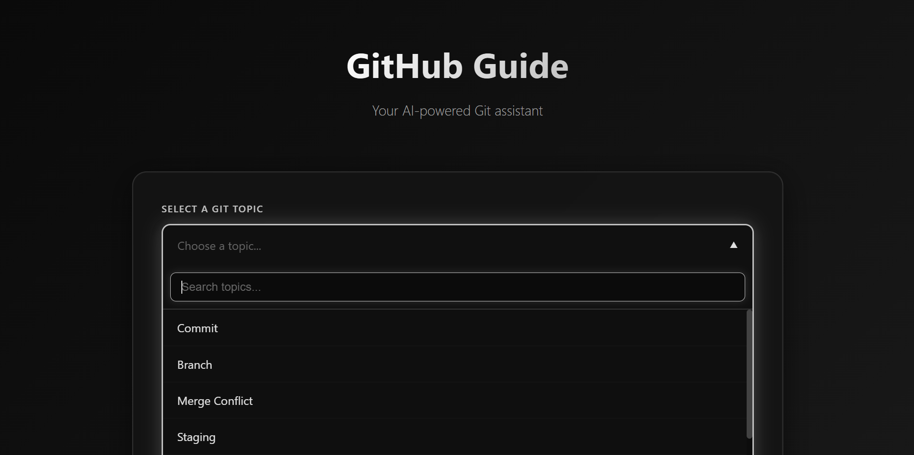
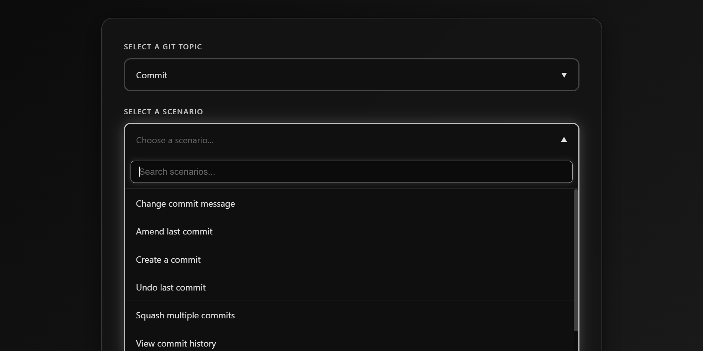
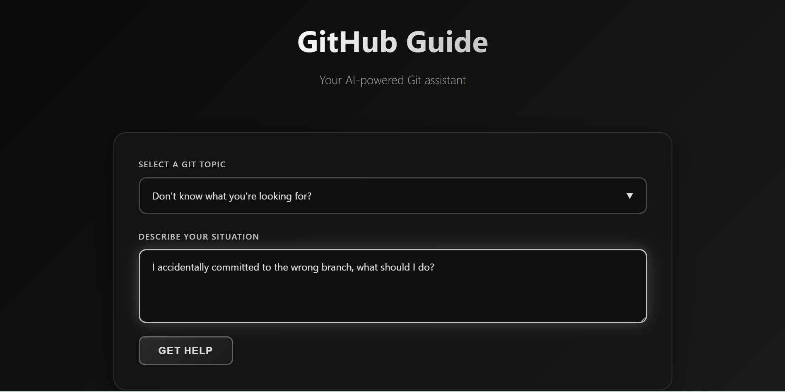
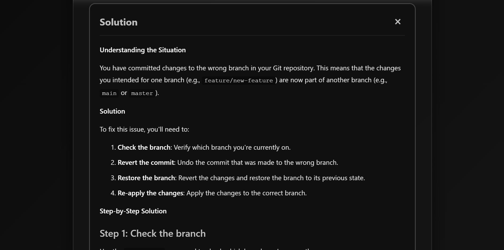

# GitHub Guide 🚀

<div align="center">

**AI-Powered Git Assistant | Master Git Commands & Workflows**

[](https://nodejs.org/)
[](https://expressjs.com/)
[](https://developer.mozilla.org/en-US/docs/Web/JavaScript)
[](https://groq.com/)
[](https://openai.com/)

*Simplifying Git workflows with AI-powered assistance and intelligent command generation*

</div>

---

**GitHub Guide** is a beautiful, modern web application that helps developers master Git commands and workflows using AI-powered assistance. Built with Node.js, Express, and integrated with Groq or OpenAI APIs, this application revolutionizes how developers learn and use Git by providing instant, contextual solutions to common Git problems. From commit operations to merge conflict resolution, GitHub Guide brings clarity and efficiency to version control workflows.

The platform features an intuitive, dark-themed user interface with searchable dropdowns, smart Git-related question detection, and comprehensive AI-generated solutions. Whether you're a beginner learning Git basics or an experienced developer looking for quick command references, GitHub Guide streamlines the entire Git learning and problem-solving process.

## 🌟 Features

### 1. Intelligent Topic Selection

Browse through comprehensive Git topics with an intuitive, searchable interface:

- **Visual Topic Display**: All Git topics are displayed in an elegant dropdown with smooth animations
- **Search Functionality**: Instantly search through topics using the built-in search bar
- **Comprehensive Coverage**: Covers all major Git operations including Commit, Branch, Merge Conflict, Staging, Remote, Reset & Revert, Stash, Tag, and Log & History
- **Easy Navigation**: Simple, responsive design that works seamlessly on desktop and mobile devices
- **Smart Organization**: Topics are logically organized for easy discovery



*The topic selection interface showcases all available Git topics in a clean dropdown layout. Users can search for specific topics or browse through the comprehensive list. Each topic displays with smooth hover effects for an enhanced user experience.*

### 2. Scenario-Based Solutions

Select specific scenarios within each topic to get targeted AI-powered solutions:

- **Scenario Matching**: Each topic includes multiple relevant scenarios for precise problem-solving
- **Contextual Answers**: Get solutions tailored to your specific Git scenario
- **Step-by-Step Instructions**: Receive detailed, step-by-step instructions with exact commands
- **Examples Included**: Solutions come with practical examples and code snippets
- **Best Practices**: Learn recommended approaches and important warnings



*The scenario selection interface appears after selecting a topic, showing all relevant scenarios for that specific Git operation. Users can see scenarios like "Change commit message", "Amend last commit", "Create a commit", and more when the "Commit" topic is selected. Each scenario triggers an instant AI-generated solution.*

### 3. Custom Question Support

Ask any Git-related question in natural language when you don't know exactly what you're looking for:

- **Natural Language Processing**: Describe your Git situation in plain English
- **Smart Detection**: Automatically validates that questions are Git-related
- **Comprehensive Analysis**: AI analyzes your situation and provides tailored solutions
- **Context Understanding**: Understands complex Git workflows and edge cases
- **Interactive Input**: Clean text area with keyboard shortcuts (Ctrl+Enter to submit)



*The custom question interface appears when you select "Don't know what you're looking for?" from the topic dropdown. Users can describe their Git situation or question in natural language, and the AI will analyze it to provide a comprehensive solution.*

### 4. AI-Powered Responses

Get intelligent, detailed solutions powered by advanced AI models:

- **Multiple AI Providers**: Supports both Groq API (recommended - better free tier) and OpenAI API
- **Fast Responses**: Quick, accurate answers to your Git questions
- **Markdown Formatting**: Beautifully formatted responses with syntax highlighting
- **Code Blocks**: All Git commands are displayed in properly formatted code blocks
- **Structured Solutions**: Responses include explanations, commands, warnings, and examples
- **Copy-Friendly**: Easy to copy commands and solutions for immediate use



*The response panel displays AI-generated solutions with proper formatting, code blocks for Git commands, and clear explanations. Users can easily copy commands or scroll through detailed instructions.*

### 5. Comprehensive Git Topics Coverage

Access solutions for all major Git operations and workflows:

#### Commit Operations
- Change commit message
- Amend last commit
- Create a commit
- Undo last commit
- Squash multiple commits
- View commit history
- Commit specific files only

#### Branch Management
- Create a new branch
- Delete a branch
- Switch between branches
- Rename a branch
- Merge branches
- View all branches
- Compare branches

#### Merge Conflict Resolution
- Resolve merge conflicts
- Prevent merge conflicts
- Abort a merge
- Understand conflict markers
- Merge strategies

#### Staging Operations
- Stage your changes
- Unstage files
- Stage specific files
- View staged changes
- Stage all changes

#### Remote Repository Management
- Add remote repository
- Remove remote
- Push to remote
- Pull from remote
- Clone a repository
- View remote URLs
- Change remote URL

#### Reset & Revert Operations
- Reset to previous commit
- Revert a commit
- Hard reset
- Soft reset
- Mixed reset
- Undo changes

#### Stash Operations
- Save changes to stash
- Apply stashed changes
- View stash list
- Delete stash
- Pop from stash

#### Tag Management
- Create a tag
- Delete a tag
- Push tags to remote
- List all tags
- Checkout a tag

#### Log & History
- View commit log
- Search commit history
- View file history
- Compare commits
- Find when bug was introduced

### 6. Beautiful, Modern UI

Experience a polished, professional interface designed for developers:

- **Dark Theme**: Easy on the eyes with a modern dark color scheme
- **Smooth Animations**: Elegant transitions and hover effects throughout
- **Responsive Design**: Works perfectly on all screen sizes
- **Intuitive Navigation**: Clear, logical flow from topic selection to solution
- **Clean Typography**: Readable fonts optimized for code and text
- **Accessible**: Keyboard shortcuts and proper ARIA labels for accessibility

### 7. Smart Validation

Ensures all questions are Git-related for accurate responses:

- **Keyword Detection**: Automatically detects Git-related keywords in custom questions
- **Comprehensive Git Terms**: Recognizes all common Git terminology
- **Helpful Error Messages**: Clear guidance when questions aren't Git-related
- **Suggestions**: Prompts users to rephrase non-Git questions

## 🚀 Quick Start (Local Development)

### Prerequisites
- Node.js 14.0.0 or higher
- npm (comes with Node.js)
- Git (for version control)
- API key from [Groq Console](https://console.groq.com/keys) (recommended) or [OpenAI Platform](https://platform.openai.com/api-keys)

### 1. Clone the Repository
```bash
git clone <your-repo-url>
cd GitHub-Guide
```

### 2. Install Dependencies
```bash
npm install
```

### 3. Set Up Environment Variables

Create a `.env` file in the root directory:

**Recommended: Get a FREE Groq API key** (much better free tier!)
- Go to [Groq Console](https://console.groq.com/keys)
- Sign up (it's free!)
- Create an API key
- Add to `.env`:
  ```
  GROQ_API_KEY=your_groq_api_key_here
  ```

**Alternative: OpenAI API** (limited free tier)
- Get your API key from [OpenAI Platform](https://platform.openai.com/api-keys)
- Add to `.env`:
  ```
  OPENAI_API_KEY=your_openai_api_key_here
  ```

### 4. Start the Server
```bash
npm start
```

The server will run on `http://localhost:3000`

### 5. Open in Browser

Navigate to `http://localhost:3000` in your web browser to start using GitHub Guide!

## 📊 API Comparison

### Groq API (Recommended)
- ✅ 30 requests per minute
- ✅ 14,400 requests per day
- ✅ Completely free!
- ✅ Faster responses than OpenAI
- ✅ Uses Llama 3.1 8B model

### OpenAI API (Alternative)
- ⚠️ Limited free tier
- ✅ Uses GPT-3.5-turbo model
- ⚠️ Rate limits may apply

**Recommendation**: Use Groq API for the best free tier experience!

## 🤝 Contributing

1. Fork the repository
2. Create a feature branch (`git checkout -b feature/amazing-feature`)
3. Commit your changes (`git commit -m 'Add some amazing feature'`)
4. Push to the branch (`git push origin feature/amazing-feature`)
5. Open a Pull Request

## 📄 License

This project is licensed under the MIT License - see the LICENSE file for details.

## 🙏 Acknowledgments

- **Groq**: For providing excellent free-tier API access
- **OpenAI**: For GPT models and API services
- **Git Community**: For the comprehensive Git documentation that inspired this project

---

**GitHub Guide** - Making Git commands accessible and easy to understand! 🚀📚
